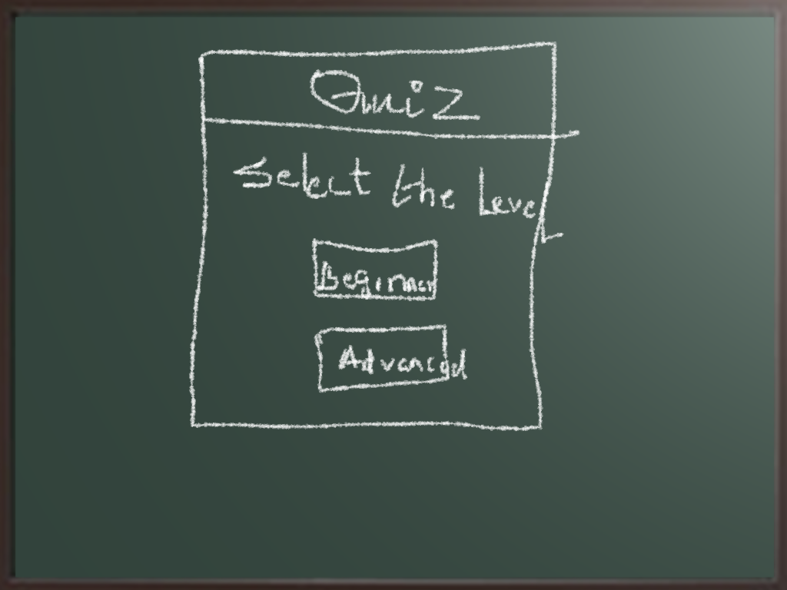
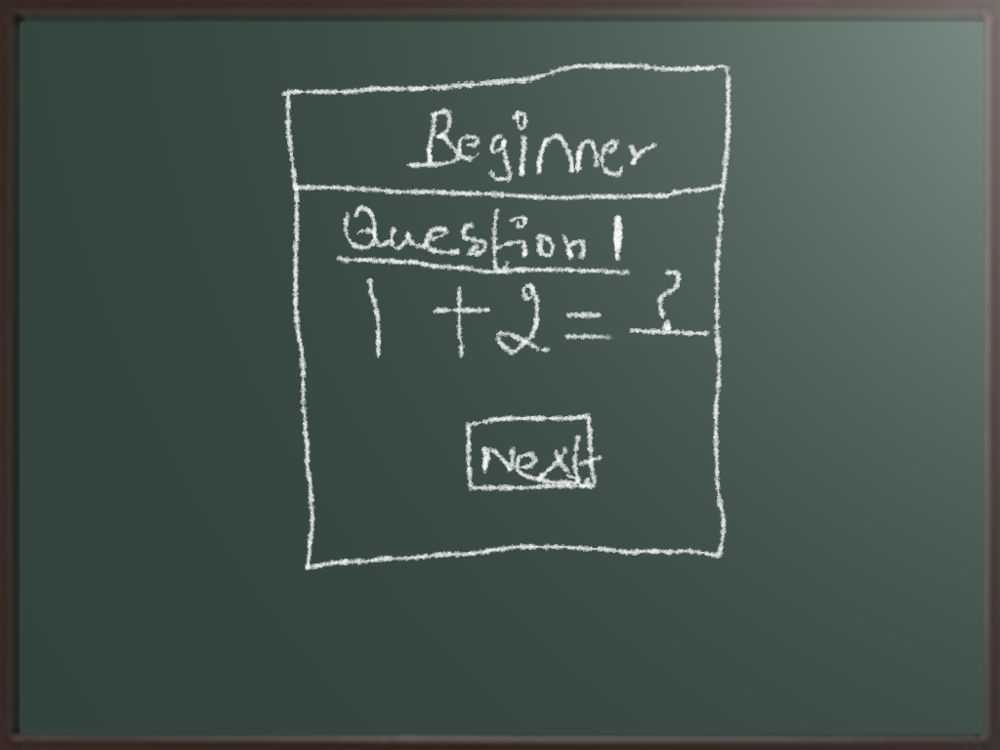
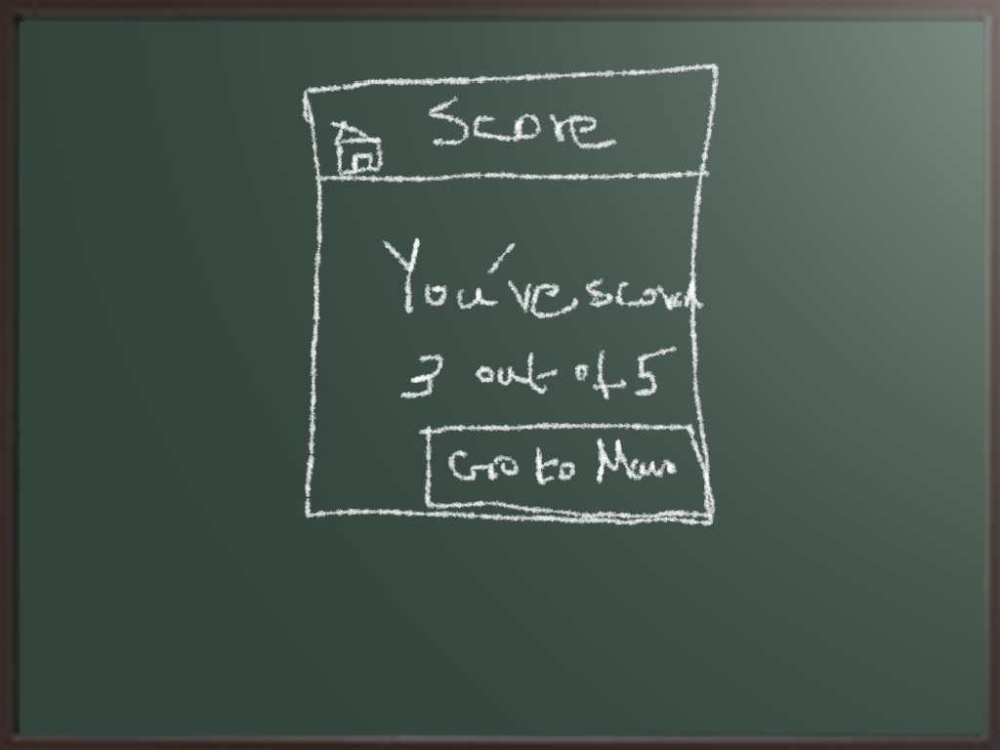
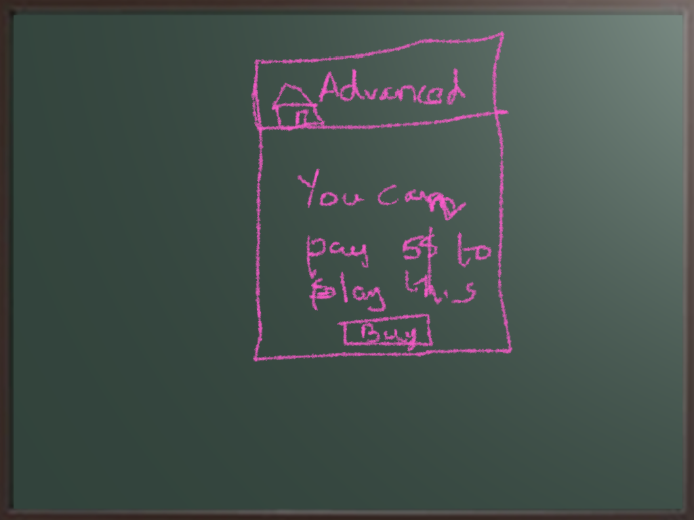

= jQM and Backbone

[abstract]
Create a jQM application using Backbone. The application is a simple arithmetic quiz app. Take a look at the screen shots.

 +

 +

 +

 +

== Step: 1

You have to implement your webserver to return 5 simple arithmentic questions with answers randomly from a set of say 10 questions. When you send the request to /QandA you should send a JSON array of 5 questions. The format of JSON is left to you.

== Step: 2

Implement the screens in jQM and use Backbone for modularity. In the 'Advanced' screen, when you click buy launch web browser to show 'Google' page for the time being.

 

